# BenchGen Router Lite: dataset and pipeline

<p align="center">
  
</p>

The dataset behind **BenchGen Router Lite**, a small routing model that learns *which* language
model should answer each query instead of sending every query to the same one, plus the five
scripts that generated it end to end. Built on [BenchGen](https://benchgen.com), the platform
this pipeline runs on end to end: dataset publishing, router training, and benchmarking.

**Full write-up:** [benchgen.com/docs/guides/router-head/benchgen-router-lite](https://benchgen.com/docs/guides/router-head/benchgen-router-lite)

The router itself never generates an answer. It looks at a query, picks the best member of a
fixed model pool, and that pool member's real reply is what comes back. To learn that, it needs
proof that different models really are better at different things. That proof is a **reward
matrix**: for every task, how well each candidate model actually scored, measured rather than
assumed. This repository is how that matrix was built, and what it turned out to say.

## The headline finding

> A routing dataset is only useful if **no single agent dominates**. If one agent is best almost
> everywhere, the optimal router is "always pick that agent" and no amount of training helps.

The pilot matrix collected here **does not clear that bar**, and this repository says so on the
front page rather than in a footnote. `reports/dataset_health.md` returns **STOP** on three of
eight gate metrics:

| Metric | Value | Stop threshold |
| --- | ---: | --- |
| Tasks with a unique best agent | 11.7% | 15% or less |
| Weakest agent's uniquely-best share, scaled | 0.0000 | 0.10 or less |
| Worst agent's empty-response rate | 15.6% | 10% or more |

On most tasks either every agent gets it right or none do, and neither case carries routing
signal. That is a real result about this pool, not a bug: it is exactly what the gate exists to
catch, and catching it before training is the entire point. It is also why the release is a
**pilot** and the head trained on it is **Lite**.

For contrast, the earlier attempt that motivated this whole design collected 2,700 real calls and
trained two heads before anyone noticed 75.3% of its tasks scored every agent identically. The
router it produced exactly matched "always pick one specific model".

## What is in here

| Path | What |
| --- | --- |
| `pipeline/` | The five scripts that generated everything, in order |
| `configs/` | Agent pool and call protocol, sampling plan and seed, gate thresholds |
| `data/tasks.v1.jsonl` | 1,110 normalized tasks across 8 benchmark sources |
| `data/rewards.v1-pilot.jsonl` | The reward matrix: 900 graded calls with per-call cost, latency and tokens |
| `data/publish/` | The redacted release: 46 tasks, rewards and metadata only, no prompt text |
| `reports/` | Task pool, health gate, and baselines, each reproducible byte for byte |
| `src/benchgen_router_dataset/` | The library the pipeline drives |
| `tests/` | 85 tests over graders, schemas, gates, splits, and the collection runner |

## The pipeline

```bash
python pipeline/01_verify_pool.py            # Gate 1: every agent proven to answer
python pipeline/02_build_task_dataset.py     # -> data/tasks.v1.jsonl
python pipeline/03_collect_rewards.py        # -> data/rewards.v1-pilot.jsonl
python pipeline/04_gate_and_baselines.py     # Gate 3, plus the baselines to beat
python pipeline/05_publish.py --push         # -> the two published datasets
```

Stages run in order and each refuses to run ahead of its gate. Stage 3 raises rather than start
against a slug Stage 1 never verified, because collecting from a dead slug fills a whole reward
column with silent zeros and teaches a router to avoid a model that was never actually broken.

See [pipeline/README.md](pipeline/README.md) for what each stage enforces.

### Setup

```powershell
python -m venv .venv
.\.venv\Scripts\python.exe -m pip install -e ".[dev,sources]"
.\.venv\Scripts\python.exe -m pytest -q
Copy-Item .env.example .env      # then fill in OPENROUTER_API_KEY
```

Run every command from the repository root. Stages 1 and 3 make live calls and need
`OPENROUTER_API_KEY`. Stage 2 needs network access on its first run. **Stages 4 and 5 need
neither**, which makes them a free regression test:

```bash
python pipeline/04_gate_and_baselines.py && git diff --stat reports/
```

Every report carries a SHA-256 digest of its inputs and no timestamps, so an empty diff there
means nothing drifted. Stage 4 exits non-zero on a STOP verdict, so CI can enforce the gate.

## The model pool

Every model is reached through [OpenRouter](https://openrouter.ai), so the pool can mix
closed-style and open-weight models behind one API and one billing account.

| Role | Agent | Model | Mode |
| --- | --- | --- | --- |
| Frontier | `frontier_a` | `openai/gpt-oss-120b` | Reasoning |
| Frontier | `frontier_b` | `deepseek/deepseek-v4-flash-0731` | Reasoning |
| Frontier | `frontier_c` | `google/gemma-3-27b-it` | Direct |
| Mid-tier | `open_mid` | `mistralai/mistral-nemo` | Direct |
| Cheap reasoning | `open_cheap_reasoning` | `inclusionai/ling-3.0-flash` | Reasoning |

The three frontier slots are the strong anchors a naive "always use one model" strategy would
pick. The mid-tier slot is deliberately the weakest agent, included specifically to test whether
it is ever uniquely best on cheap questions. The cheap reasoning slot comes from a different
vendor family so its failures do not correlate with the frontier slots.

Every agent is called under identical settings (`max_tokens` 4,096, `temperature` 0.1, `top_p`
1.0, minimal reasoning effort, 3 repetitions), so a score difference reflects the model and not
the prompt conditions. Ties stay explicit rather than collapsing to a single winner, because on
easy questions several agents are genuinely equal and pretending otherwise teaches a router a
coin flip.

## Baselines

Measured on the held-out `test` split. Every published number ships with these next to it,
because a routing dataset that reports only the winner's score invites exactly the mistake above.

| Policy | Mean reward |
| --- | ---: |
| `frontier_a` | 0.6667 |
| `open_cheap_reasoning` | 0.6667 |
| `frontier_b` | 0.6410 |
| `frontier_c` | 0.5641 |
| `open_mid` | 0.2308 |
| Uniform random pick | 0.5538 |
| **Best single fixed agent** | **0.6667** |
| **Per-question oracle (upper bound)** | **0.7692** |

The gap between the best fixed agent and the oracle, **0.1026**, is the routing headroom: the
most a trained router could possibly gain over always calling `frontier_a`. Any router that does
not land inside that band was not worth training.

## What is published, and what is not

The release in `data/publish/` carries rewards, tie flags, empty and error counts, and per-task
metadata. It carries **no question text and no raw model completions**. Upstream licences differ
per source and provider terms on republishing completions were never cleared, so the safe release
is rewards plus metadata; `task_id` lets a consumer rehydrate the prompt from upstream.

Two independent safeguards enforce that. The public row type has no prompt or completion field at
all and forbids extra fields, so one cannot be added by accident, and the finished export is
scanned for anything resembling question text before a single byte is uploaded.

One source, `rlpr`, was collected but excluded from the release: its answers are free-form prose
and tables, and the normalized string-match grader used here scores genuinely correct answers as
wrong. A label that cannot be trusted is worse than no label.

## Design credit

The dataset design follows Sakana AI's Trinity paper ([arXiv:2512.04695](https://arxiv.org/abs/2512.04695)),
in particular its Appendix A.6 criterion for choosing an agent pool by Relative Error Reduction
rather than by intuition, and its use of a static reward matrix so a coordinator can be trained
label-free without calling any pool model during training.

## Licence

Code is Apache-2.0. The task pool aggregates upstream benchmarks under their own licences (MIT,
Apache-2.0, CC-BY-SA-4.0); see the `source.license` field on every task row and the per-source
table in `reports/task_pool.md`.
